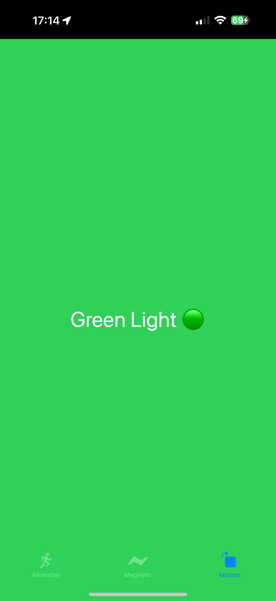

# Sensory-Overload
A small sample project that looks at how some sensors work in your iPhone.

# Purpose
This is mainly to educate myself and others about how some sensors in an iPhone works. This includes the Magnetomer that detects the magnetic field around you and will update as you move the phone around, Altitude sensor that looks at measures how high you are above sea level in meters, and Motion Manager that changes the colour of the screen when it detects movement on the phone. This is a proof of concept only and can be expanded upon in the future.

| Get User Permissions| Altimeter | Magnetometer | Core Motion |
| ----------- | ----------- | ----------- | ----------- | 
|     |         |  |   |

# Useful links
Here are some links I found interesting in my readings:

### Sensors:
https://medium.com/@laura.nadolski/iphone-sensors-an-introduction-9d3205b66a90

### Core Location - Altitude:
https://developer.apple.com/documentation/corelocation/cllocation/altitude
https://stackoverflow.com/questions/4870480/ios-corelocation-altitude
https://medium.com/@ilya.virnik/tutorial-get-users-altitude-in-swift-33d23b299bbe
https://blog.stackademic.com/core-location-for-ios-swift-tracking-user-locations-8e87f154c9e0
https://whatismyelevation.com
https://forums.macrumors.com/threads/core-motion-altitude-vs-core-location-altitude.1788172/
https://developer.apple.com/forums/thread/659367

### Magnetometers:
https://developer.apple.com/documentation/coremotion/cmmagnetometerdata
https://www.phidgets.com/docs/Magnetometer_Guide
https://www.oreilly.com/library/view/basic-sensors-in/9781449309480/ch05.html

### Motion Manager - Accelerometer
https://developer.apple.com/documentation/coremotion/
https://developer.apple.com/documentation/coremotion/getting-raw-accelerometer-events
https://electronics.howstuffworks.com/iphone.htm
https://www.oreilly.com/library/view/basic-sensors-in/9781449309480/ch04.html
https://en.proft.me/2022/02/23/detecting-motion-and-orientation-coremotion/